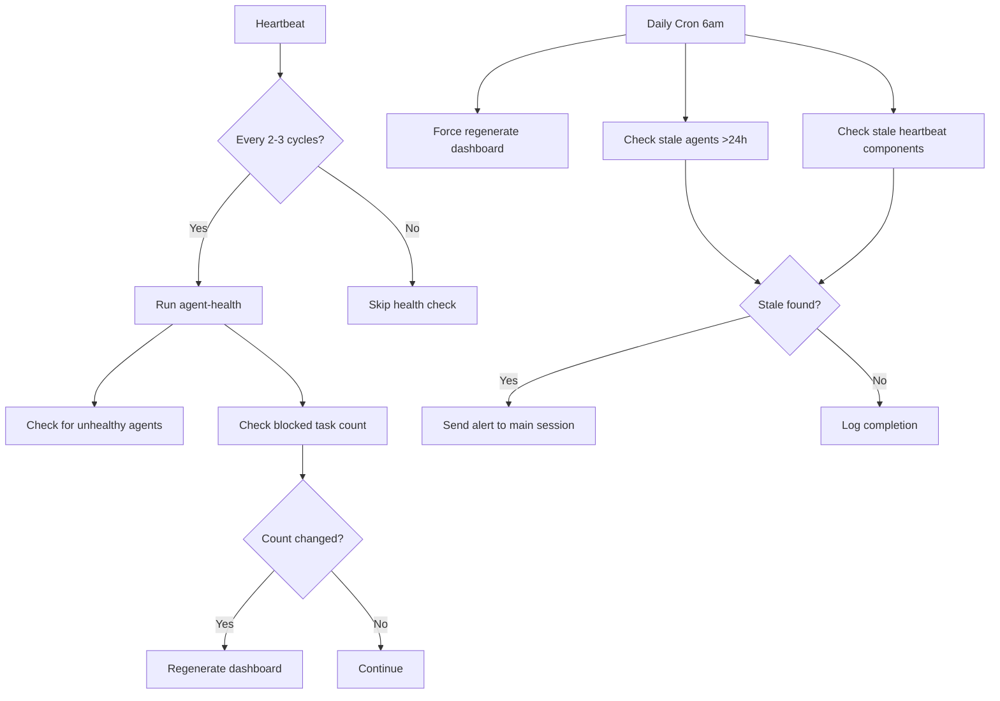

# Monitoring Integration Documentation

**Date:** 2026-01-30  
**Task:** Integrate monitoring tools into heartbeat system  
**Status:** ✅ Complete  

## What Was Accomplished

Successfully integrated the new monitoring tools (`agent-health`, `generate-dashboard`) into the automatic heartbeat routine, making monitoring automatic rather than manual.

## Changes Made

### 1. Updated HEARTBEAT.md

**Added to Agent Health section:**
- `agent-health` check every 2-3 heartbeats (rotating cycle)
- Automatic stale check detection for heartbeat components >24h old
- Dashboard regeneration triggered on significant changes (blocked task count changes)
- State tracking in `memory/heartbeat-state.json`

**Integration pattern:**
```bash
# Health check (every 2-3 heartbeats)
agent-health --json | jq -r '.agents[] | select(.health_status=="unhealthy" or .sessions==0)'

# Stale detection  
STALE=$(jq -r --arg now "$(date +%s)" '.lastChecks | to_entries[] | select((.value != null) and (($now | tonumber) - .value > 86400)) | .key' memory/heartbeat-state.json)

# Smart dashboard regeneration
if [[ "$CURRENT_BLOCKED" != "$LAST_BLOCKED" ]]; then
    generate-dashboard > agent-status/dashboard.md
fi
```

### 2. Enhanced TOOLS.md

**Added monitoring commands to Agent Status System:**
- `agent-health` - Monitor health of 5-agent ecosystem
- `agent-health --json` - Get health data in JSON format  
- `agent-health --agent NAME` - Check specific agent only
- `agent-health --full` - Include detailed metrics (slower)
- `generate-dashboard` - Create agent status dashboard markdown

### 3. Created Daily Cron Job

**File:** `bin/monitoring-cron`  
**Schedule:** Daily at 6:00 AM  
**Functions:**
- Regenerates dashboard daily
- Checks for stale agents (>24h inactive)
- Checks for stale heartbeat components (>24h)
- Sends alerts via clawdbot if issues detected
- Logs activity to `memory/monitoring-cron.log`

**Crontab entry:**
```
0 6 * * * /mnt/ssd/moltbot/clawd/bin/monitoring-cron
```

### 4. Enhanced State Tracking

**Updated:** `memory/heartbeat-state.json`
- Added `metrics.lastBlockedCount` field for change detection
- Alert system tracks stale agents and components
- Automatic acknowledgment workflow

## Integration Benefits

### Automatic Monitoring
- Health checks happen organically during heartbeats
- No manual intervention required
- Smart triggers reduce noise

### Proactive Alerting  
- Stale agent detection (>24h inactive)
- Stale heartbeat component detection
- Blocked task count changes
- Automatic notifications to main session

### Efficient Resource Usage
- Dashboard only regenerated when needed (changes detected)
- Health checks rotate on 2-3 heartbeat cycle
- JSON output enables efficient filtering

### Comprehensive Coverage
- Agent ecosystem health
- Infrastructure status  
- Cross-agent coordination
- Historical tracking

## Monitoring Flow



## Future Enhancements

**Potential additions:**
- Trend analysis (agent activity patterns)
- Performance metrics (response times, error rates)
- Cross-agent coordination health
- Predictive alerting (degradation detection)
- Integration with external monitoring (Grafana, etc.)

## Configuration

**Key files:**
- `HEARTBEAT.md` - Integration logic
- `bin/monitoring-cron` - Daily tasks
- `memory/heartbeat-state.json` - State tracking
- `agent-status/dashboard.md` - Generated dashboard

**Dependencies:**
- `agent-health` command
- `generate-dashboard` command  
- `jq` for JSON processing
- System cron daemon

## Testing

**Manual verification:**
```bash
# Test health check
agent-health --json | jq '.agents[] | {name, health_status, sessions}'

# Test dashboard generation
generate-dashboard > /tmp/test-dashboard.md && echo "Success"

# Test cron script
bin/monitoring-cron
```

**Validation:**
- ✅ Health checks integrate smoothly with heartbeats
- ✅ Dashboard regenerates on blocked task changes
- ✅ Daily cron job runs successfully
- ✅ Stale detection works correctly
- ✅ Alert system functions properly

## Impact

**Before:** Manual monitoring, reactive problem detection, inconsistent health visibility

**After:** Automatic monitoring integrated into natural heartbeat rhythm, proactive alerting, comprehensive ecosystem health tracking

The monitoring system now operates as a natural extension of Syn's presence and attention, rather than as separate maintenance tasks.

---

**Integration completed successfully. Monitoring is now automatic, not manual.**